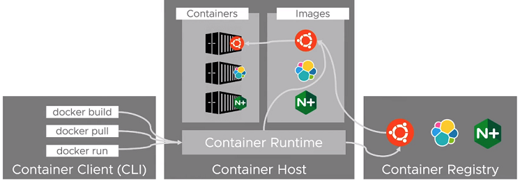

# Docker - Practise 2

## Dockerfile
A Dockerfile is a plain text file that contains the necessary instructions to create an image that will become an application used for a purpose.

Inside the `Dockerfile` file there are some statements that can be used:
1) `FROM  <imagen>` or `FROM  <imagen>:<tag>` --> indicates the image upon which the container will be created
    * The image can be an operating system like Ubuntu, Amazon Linux, Debian, Alpine, etc., or ir could images with a pre-installed environmento or app like Nginx, Terraform, python, php o Tomcat
2) `ENV` --> set the environment variables for our container, in this case we will use `DEBIAN_FRONTEND noninteractive`, which allow us to install `.deb` packages without interacting with them or giving approval. Syntax is:
    * `ENV <key>=<value>`
    * `ENV MY_VAR my-value`
3) `RUN` --> it allows to execute commands in the container image, per example, install packages and libraries (apt-get, yum install, etc.). There are two ways to use it:
    * `RUN <command>`
    * `RUN ["executable","parameter1","parameter2"]`
        * This latest instruction is very useful because it allows to execute commands in images that do not have /bin/sh
4) `COPY` --> copies files from the directory in which `Dockerfile` is located to the container:
    * `COPY hello.* /my_directory/`
        * adding the flag `ADD --chown` permissions can be specified
5) `ADD` --> also copies new files, new directories o remote files from an URL or source directory to a remote directory in the container. Syntax:
    * `ADD hello.txt /my_directory/`
        * con el flag `ADD --chown` se pueden especificar permisos
6) `WORKDIR` --> sets a working directory for all commands `RUN`, `CMD`, `ENTRYPOINT`, `COPY` o `ADD`
7) `ARG` --> defines a variable that users can pass during container creation using the flag `--build-arg <varname>=<value>`. There are some pre-existing ARGs on each platform as follows:
    * TARGETPLATFORM - container plataform `linux/amd64`, `linux/arm/v7`, `windows/amd64`, etc.
    * TARGETOS - operating system component for TARGETPLATFORM
    * TARGETARCH - architecture component for TARGETPLATFORM
    * TARGETVARIANT - variant component for TARGETPLATFORM
    * BUILDPLATFORM - plataform of the node that runs the creation
    * BUILDOS - operating system component for BUILDPLATFORM
    * BUILDARCH - architecture component for BUILDPLATFORM
    * BUILDVARIANT - cvariant component for BUILDPLATFORM
    * There are some pre-defined ARGs as well:
        * `HTTP_PROXY`
        * `HTTPS_PROXY`
        * `FTP_PROXY`
        * `NO_PROXY`
            * Rule of the thumb: `ENV` always overwrites `ARG`
8) `ENTRYPOINT` --> allows to configure a container that will run as an executable. As a disadvantage, it initiates with the sub-command `/bin/sh -c`. It can be used in two ways:
    * `ENTRYPOINT ["executable","parameter1","parameter2"]`
    * `ENTRYPOINT command parameter1 parameter2`
9) `CMD` --> only one can exist `CMD` on each `Dockerfile` and it allows to add the arguments by default for the execution of a container. Used in three manners:
    * `CMD ["executable","parameter1","parameter2"]` --> EXEC form
    * `CMD ["parameter1","parameter2"]` --> ENTRYPOINT form
    * `CMD command parameter1 parameter2` --> SHELL form
10) `LABEL` --> adds metadata to the image with a format of ("key"="value")
    * `LABEL maintainer="JuliBCN <julibcn@gmail.com>"`
    * `LABEL version="1.0"`
    * `LABEL description="This is a description for a Docker Container"`
        * The old instruction `MAINTAINER` is no longer valid
11) `EXPOSE` --> informs Docker that the container is going to listen on specific network ports and protocols during execution. It can use protocols TCP or UDP and we can have more than one on a container:
    * `EXPOSE 80/tcp`
    * `EXPOSE 80/udp`
12) `VOLUME` --> creates a mount point with a specific name and marks it as static and persistent inside the host. It can be declared in two ways:
    * `VOLUME ["/my_disk_1"]`
    * `VOLUME /my_disk_1 /my_disk_2`
        * On Windows, the path must use disk C:\
13) `USER` --> establishes the user or UID and the group (GID) as optional that can be used while executing with `RUN`, `CMD` o `ENTRYPOINT`
14) `ONBUILD` --> adds to the image a trigger that can be executed afterwards when the image is part of another build as part of its metadata
15) `STOPSIGNAL` --> sets the system call that will be sent to the container on exit. It can be used as the kernel table calls (9) or in the format `SIGNAME` (SIGKILL)
16) `HEALTHCHECK` --> sayd to Docker how to check if the container is still working. It is commonly used with the command `CMD` and has some options:
    * --interval=DURATION (init: 30s)
    * --timeout=DURATION (init: 30s)
    * --start-period=DURATION (init: 0s)
    * --retries=N (init: 3)
17) `SHELL` --> allows the default shell to be used by commands directly. In Linux, initial shell is `["/bin/sh", "-c"]`, and in Windows `["cmd", "/S", "/C"]`. This command is mostly used in Windows to specify the usage of `powershell`. Examples:
    * direct usage
        * RUN powershell -command Write-Host default
    * usage with shell
        * SHELL ["powershell", "-command"]
        * RUN Write-Host hello
    * direct usage
        * cmd /S /C powershell -command Execute-MyCmdlet -param1 "c:\foo.txt"
    * usage with shell
        * RUN ["powershell", "-command", "Execute-MyCmdlet", "-param1 \"c:\\foo.txt\""]

Lifecycle and workflow of containers:

