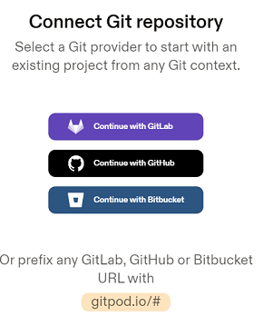

# Docker - Practise 3


## GitPod: https://gitpod.io
Gitpod is a container-based development platform that puts developer experience first. Gitpod provisions ready-to-code developer environments in the cloud accessible through your browser and your local IDE.

Gitpod enables development teams to describe their dev environment as code and start configurable and fresh developer environments for each new task entirely in the cloud. Think CI/CD for dev environments.

A Gitpod workspace includes everything developers need to be productive: source code, a Linux shell with root/sudo, a file system, the full VS Code editing experience including extensions, language support and all other tools and binaries that run on Linux.

Workspaces are highly customizable and can be pre-configured and optimized on both a team/project as well as an individual/developer level. From themes to extensions developers have full control. Workspaces work with all major Git hosting platforms including GitHub, GitLab and Bitbucket.


## Create an account in GitPod
1) Create an account in GitHub --> https://github.com
2) Create an account in GitLab --> https://gitlab.com
3) Create an account in Docker Hub --> https://hub.docker.com
4) Sign-Up on GitPod with our preferred SCM Tool (GitLab or GitHub) --> https://gitpod.io
* Press "Sign Up" and choose "Continue with GitHub" or "Continue with GitLab". It will ask for confirmation



5) Now we can create our WorkSpace in GitPod with an existing repository doing the following:
* From GitLab: used the embedded button to open in GitPod
* From GitHub: append the URL of our repo to https://gitpod.io#

6) Once connected, let's verify that everything is functional:
```bash
sudo apt-get update && sudo apt-get upgrade -y
docker version
git version
docker images
```

Execution in GitPod requires to use ports above 2000. Recommend ports are 3000 and 44444.
