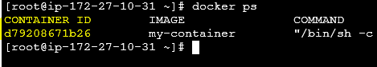

# Docker - Practise 4


## Our First Container
Anything on the internet is always starting with pre-installed apps that always work or a basic "Hello World" message on the console, so we better cook it all by ourselves. First, we will create a directory to work in which we can create the main configuration file for Docker, called `Dockerfile` (starting with a capital D).

1) We can use GitHub or GitLab to fork/copy our source repository:
* Name: `my_docker`
* Description: `my_docker`
2) Copy all files from URL https://github.com/Juli-BCN/my_docker
* We can use different mechanism to copy the files, like manual copy+paste, clon in Visual Studio Code (git clone + git push) or do a "fork" from GitHub
3) Modify the file `Dockerfile` to choose which image we want to consume:
```
FROM ubuntu:20.04
```
4) Modify line 3 to show some personal values to use as `maintainer`:
```
LABEL maintainer="JuliBCN <julibcn@gmail.com>"
```
5) Choose timezone by leaving only one line with our right info. Some examples:
```
ENV TZ=Europe/Dublin
ENV TZ=America/Mexico_City
```
6) Line 12, we will add the commands to update the operating system and install the websever:
```
RUN apt-get update && apt-get -y install apache2
```
7) Line 18, prepare environment variables and the start-up script:
```
RUN echo '. /etc/apache2/envvars' > /root/run_apache.sh && \
 echo 'mkdir -p /var/run/apache2' >> /root/run_apache.sh && \
 echo 'mkdir -p /var/lock/apache2' >> /root/run_apache.sh && \ 
 echo '/usr/sbin/apache2 -D FOREGROUND' >> /root/run_apache.sh && \ 
 chmod 755 /root/run_apache.sh
```
8) Line 22, add the command that will start the Apache Web Server:
```
CMD /root/run_apache.sh
```


## Build the container
To build a container from a `Dockerfile`, we will use the command `docker build` using the flag `-t` tag the container name/version. Note that there is a '.' (dot) at the end of the command that specifies that we are working with the current directory:
```bash
docker build -t my_docker:v1 .
```

Now we can see that the new image has been added to the list of available images with command `docker images`:
```bash
docker images
```


## Run the container
We can start our container using the command `docker container run`, that has a few flags that are useful to use:
* -d: detached, so that we can continue using the shell while the container runs
* -p: to specify the ports that will be used by both host and container
* --rm: to delete the execute container (not the image) once the container is stopped

To run the container on an EC2 instance on AWS or on our local machine, we will use:
```bash
docker container run --rm -d -p80:80 my_docker:v1
```

To run the container on GitPod, we will use:
```bash
docker container run --rm -d -p44444:80 my_docker:v1
```


## Stop the container
To stop the container that is running, we first need to know the ID assigned to the container using command `docker ps`. Once we find it, we can use Una vez averiguado, podemos pararlo con `docker container stop`:
```bash
docker ps
```



```bash
docker container stop XXXXXXXXXXXX
```
